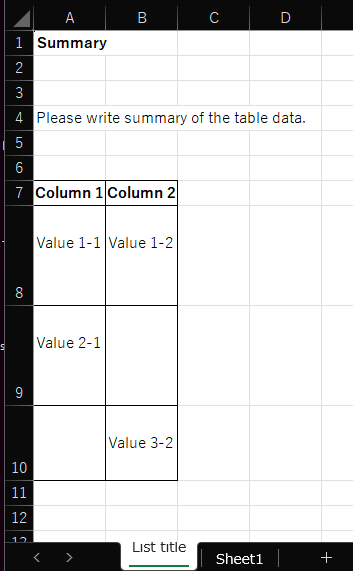

# mael for VBA

`mael for VBA` is a partial port of [mael](https://github.com/KenjiOhtsuka/mael).

This macro can convert markdown files to tables in an Excel file.

Configuration is not yet implemented.

## Usage

1. Write your data in markdown. 

```markdown
# List title

## Summary

Please write summary of the table data.

## List

### Column 1

Value 1-1

### Column 2

Value 1-2

---

### Column 1

Value 2-1

---

### Column 2

Value 3-2
```

2. Start Excel.
3. Open mael tab, click `Build`


4. Select your markdown file.

