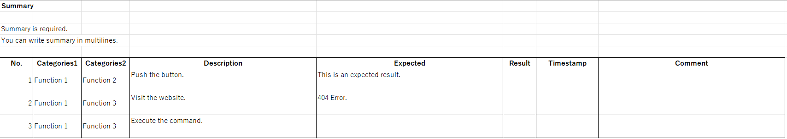

# mael for VBA

`mael for VBA` is a partial port of [mael](https://github.com/KenjiOhtsuka/mael).

This macro can convert markdown files to tables in an Excel file.

Configuration is not yet implemented.

## Usage

1. Write your data in markdown. 

```markdown
# List title

## Summary

Please write summary of the table data.

## List

### Column 1

Value 1-1

### Column 2

Value 1-2

---

### Column 1

Value 2-1

---

### Column 2

Value 3-2
```

2. Start Excel.
3. Open mael tab, click `Build`


4. Select your markdown file.


### Attention

Please write all the files in UTF-8 encoding.

## Columns configuration

Read from [config\columns.xlsx](https://github.com/yasumichi/maelForVBA/blob/main/config/columns.xlsx) .

You must copy [config](https://github.com/yasumichi/maelForVBA/tree/main/config) folder to same place of markdown file if you will use column configuration.

`config\columns.xlsx` contains the following three worksheets

- prepend
- column_conditions
- append


The following items can be set on each sheet.

- column name
- column type(`increment`, `list`, `string`)
- value(Initial value. column type `inclement` only)
- alignment
- width

When you convert the mael sample scenario [Senario 1.md](https://github.com/KenjiOhtsuka/mael/blob/main/mael/templates/test_case/Scenario%201.md) with the Sample settings, it will look like the following screenshot.


